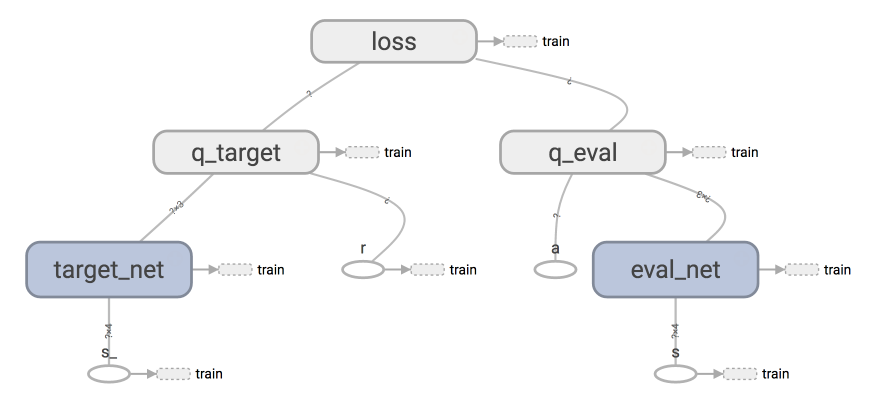
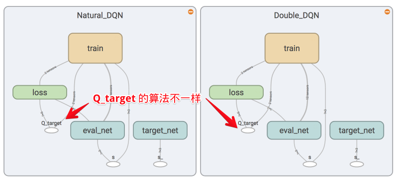
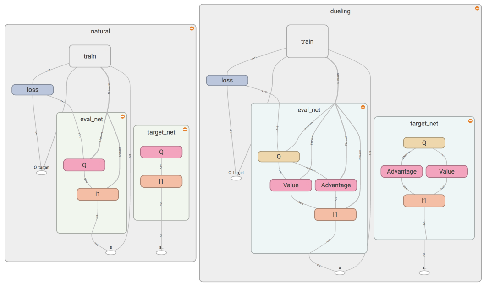

# dqn

## Training the network

- Sample a batch of transitions from the replay buffer.
- Using the next states from the sampled batch, run the target network to calculate the Q values for each of the actions
  Q(st+1,a)Q(st+1,a), and keep only the maximum value for each state.
- In order to zero out the updates for the actions that were not played (resulting from zeroing the MSE loss),
  use the current states from the sampled batch, and run the online network to get the current Q values predictions. 
  Set those values as the targets for the actions that were not actually played.
- For each action that was played, use the following equation for calculating the targets of the network:​

    $ y_t=r(s_t,a_t)+γ\cdot max_a {Q(s_{t+1},a)} $
    
- Finally, train the online network using the current states as inputs, and with the aforementioned targets.
- Once in every few thousand steps, copy the weights from the online network to the target network.

## Network Structure

# double dqn

## Training the network

- Sample a batch of transitions from the replay buffer.
- Using the next states from the sampled batch, run the online network in order to find the Q maximizing action
  argmaxaQ(st+1,a). For these actions, use the corresponding next states and run the target network
  to calculate Q(st+1,argmaxaQ(st+1,a)).
- In order to zero out the updates for the actions that were not played (resulting from zeroing the MSE loss),
 use the current states from the sampled batch, and run the online network to get the current Q values predictions.
  Set those values as the targets for the actions that were not actually played.
For each action that was played, use the following equation for calculating the targets of the network:

    $ y_t=r(s_t,a_t )+\gamma \cdot Q(s_{t+1},argmax_a Q(s_{t+1},a)) $
    
- Finally, train the online network using the current states as inputs, and with the aforementioned targets.
- Once in every few thousand steps, copy the weights from the online network to the target network.

## Network Structure

# dueling dqn

## Training the network

like dqn training process
 
## General Description

In many states, the values of the different actions are very similar, and it is less important which action to take.
This is especially important in environments where there are many actions to choose from. In DQN, on each training iteration,
for each of the states in the batch, we update the QQ values only for the specific actions taken in those states.
This results in slower learning as we do not learn the QQ values for actions that were not taken yet. On dueling architecture,
on the other hand, learning is faster - as we start learning the state-value even if only a single action has been taken
at this state.

## Network Structure

